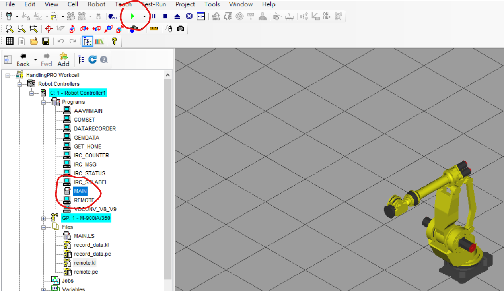

# fanuc_motion_program_exec

`fanuc_motion_program_exec` is a python module to run a squence of motion primitives (i.e. `moveL`, `moveC`, `moveJ`) on a fanuc controller in a simple way. The python module now support controlling a single or dual robots.

## Pre-request

You will need a physical FANUC robot or `RoboGuide`, the FANUC robot simulation. The following robot options are required.

- KAREL (R632)
- Ascii Program Loader (R790)
- PC Interface (R641)

For dual robot arms, the following additional option is required.

- Multi-group

## Installation on Robots

### RoboGuide

The installation of modulel in RoboGuide includes setting up a cell and loading necessary scripts.

- See

### Real Robot

TBA

## Installation of Python Module

The `fanuc_motion_program_exec` module can be install to local Python installation using the following command executed in the repository root directory.

```
pip install . --user
```

Note that the module is only tested with `python3`.

## Usage

### RoboGuide

Execute `MAIN` by selecting the `MAIN` program in the `Programs` tab and pressing the play button on top. You should see the play button turn green. Note: this step is **Extremely important!!!**. You need to make sure `MAIN` is runninng whenever you want to use the module



You can now run the python module. You can find the example code in `fanuc_client.py`

PLease consault debug if you run the python module before you execute `MAIN`.

### Python Module

The class `TPMotionProgram` constains is used to build the sequence of motions. It has the following commands of interests:

* `moveJ(target,vel,vel_unit,zone)` - Move the robot to a specified joint waypoint. `target`: `jointtarget`. `vel`: integer. `vel_unit`: `%` or `msec`. `zone`: integer in [-1,100]. `-1` stands for `FINE` corner path (zone) and others stand for `CNT`.

* `moveL(target,vel,vel_unit,zone)` - Move the robot to the specified Cartesian target using linear interpolation. `target`: either `robtarget` or `jointtarget`. `vel`: integer in [1,2000]. `vel_unit`: `mmsec`. `zone`: integer in [-1,100]. `-1` stands for `FINE` corner path (zone) and others stand for `CNT`.

* `moveC(mid_target,end_target,vel,vel_unit,zone)` - Move the robot to the specified Cartesian target circularly using an intermediate waypoint. `mid_target`,`end_target`: either `robtarget` or `jointtarget`. `vel`: integer in [1,2000]. `vel_unit`: `mmsec`. `zone`: integer in [-1,100]. `-1` stands for `FINE` corner path (zone) and others stand for `CNT`.

The constructor for `TPMotionProgram` optionally takes `t_num` and `u_num` parameters (default `t_num`:2, `u_num`:2). This paramters tell the controller which tool and user frames to be used. You will need to setup your prefer tool/user frame as described in the setup stage.

The following types are defined as subclasses of `NamedTuple`

```
class pose(NamedTuple):
    trans: np.ndarray # [x,y,z]
    rot: np.ndarray # [w,p,r] deg

class confdata(NamedTuple):
    J5: str # F or N
    J3: str # U or D
    J1: str # T or B
    turn4: int # -1 0 1
    turn5: int # -1 0 1
    turn6: int # -1 0 1

class robtarget(NamedTuple):
    group: int
    uframe: int
    utool: int
    trans: np.ndarray # [x,y,z]
    rot: np.ndarray # [w,p,r] deg
    robconf: confdata # 
    extax: np.ndarray # shape=(6,)

class jointtarget(NamedTuple):
    group: int
    uframe: int
    utool: int
    robax: np.ndarray # shape=(6,)
    extax: np.ndarray # shape=(6,)
```

See the "FANUC Robot Controller series Operator's Manual (Basic Function)" for more details on these data types. Note that `trans`, `rot`, `extax` are implemented using numpy arrays or lists. 

Once the program is complete, it can be executed on the robot using `FANUCClient`. The constructor is by default.

```
client = FANUCClient(robot_ip='127.0.0.2')
```

The `robot_ip` should be adjusted as the real robot. Once the client is constructed, it can be used to execute program.

```
log_csv_bin = client.execute_motion_program(tp)
```

`log_csv_bin` will constain a CSV file in binary format. This can be saved to a binary file directly or converted to a strinf and used in Python. To conver to a string, use:
```
log_csv = log_csv_bin.decode('utf-8')
```

The CSV data has the following columns:

* `timestamp` -  The time of the row. This is time from the startup of the logger task in milli-seconds.
* `J1` - Joint 1 position in degrees
* `J2` - Joint 2 position in degrees
* `J3` - Joint 3 position in degrees
* `J4` - Joint 4 position in degrees
* `J5` - Joint 5 position in degrees
* `J6` - Joint 6 position in degrees

The first line of the CSV data contains column headers.

You can create several `TPMotionProgram` objects that contains different movement to be executed. However you only need one `FANUCClient` to connect to the robot controller.

## Example

```
tp = TPMotionProgram()

pt1 = robtarget(1,1,2,[1850,200,290],[-180,0,0],confdata('N','U','T',0,0,0),[0]*6)
pt2 = robtarget(1,1,2,[1850,200,589],[-180,0,0],confdata('N','U','T',0,0,0),[0]*6)
jt1 = jointtarget(1,1,2,[0,20,-10,0,-20,10],[0]*6)
pt3 = robtarget(1,1,2,[1850,250,400],[-180,0,0],confdata('N','U','T',0,0,0),[0]*6)

tp.moveL(pt1,50,'mmsec',100)
tp.moveL(pt2,50,'mmsec',-1)
tp.moveJ(jt1,100,'%',-1)
tp.moveL(pt2,50,'mmsec',100)
tp.moveC(pt3,pt1,50,'mmsec',-1)
tp.moveL(pt2,50,'mmsec',-1)

print(tp.get_tp())

client = FANUCClient()
res = client.execute_motion_program(tp)

with open("fanuc_log.csv","wb") as f:
    f.write(res)

print(res.decode('utf-8'))

tp = TPMotionProgram()
tp.moveL(pt1,50,'mmsec',100)
tp.moveL(pt2,50,'mmsec',-1)
client = FANUCClient()
res = client.execute_motion_program(tp)
```

Example log CSV data (truncated)
```
timestamp,J1,J2,J3,J4,J5,J6
 0,  18.6420,   8.3360, -35.3580, -34.7470,  32.8020,  25.2540
 8,  18.6420,   8.3360, -35.3580, -34.7470,  32.8020,  25.2540
 16,  18.6420,   8.3360, -35.3580, -34.7469,  32.8020,  25.2539
 24,  18.6418,   8.3360, -35.3582, -34.7463,  32.8023,  25.2534
```

## Multi-Robot Example

Two robots can be controller using Robot Options `Multi-Group Motion (J601)`/ See [multi_robot_setup.md]() for setup instructions.

The two robot needs to have different `group_num` which are given in the `robtarget` or `jointtarget`. Execute `MAIN_MULT` (instead of `MAIN`) in RoboGuide before using the python module. The `execute_motion_program_multi` function of `FANUCClient` is used to send the two tp program to the controller for the two robots.

```
tp1 = TPMotionProgram()
tp2 = TPMotionProgram()

# these are for motion group 1 (robot 1)
jt11 = jointtarget(1,1,2,[38.3,23.3,-10.7,45.7,-101.9,-48.3],[0]*6)
pt12 = robtarget(1,1,2,[994.0,924.9,1739.5],[163.1,1.5,-1.0],confdata('N','U','T',0,0,0),[0]*6)
pt13 = robtarget(1,1,2,[1620.0,0,1930.0],[180.0,0,0],confdata('N','U','T',0,0,0),[0]*6)

# these are for motion group 2 (robot 2)
jt21 = jointtarget(2,1,2,[-49.7,4.3,-30.9,-20.9,-35.8,52.1],[0]*6)
pt22 = robtarget(2,1,2,[1383.1,-484.0,940.6],[171.5,-26.8,-9.8],confdata('N','U','T',0,0,0),[0]*6)
pt23 = robtarget(2,1,2,[1166.0,0,1430.0],[180.0,0,0],confdata('N','U','T',0,0,0),[0]*6)

tp1.moveJ(jt11,100,'%',-1)
tp1.moveL(pt12,500,'mmsec',100)
tp1.moveL(pt13,500,'mmsec',-1)

tp2.moveJ(jt21,100,'%',-1)
tp2.moveL(pt22,500,'mmsec',100)
tp2.moveL(pt23,500,'mmsec',-1)

client = FANUCClient()
res = client.execute_motion_program_multi(tp1,tp2)

with open("fanuc_log.csv","wb") as f:
    f.write(res)

print(res.decode('utf-8'))
```