# RoboGuide Set Up (Multi-Robot)

## Create Workcell

Lanuch RoboGuide and click `New Cell`, a window will pop up. Choose `HandlingPRO` and click next.

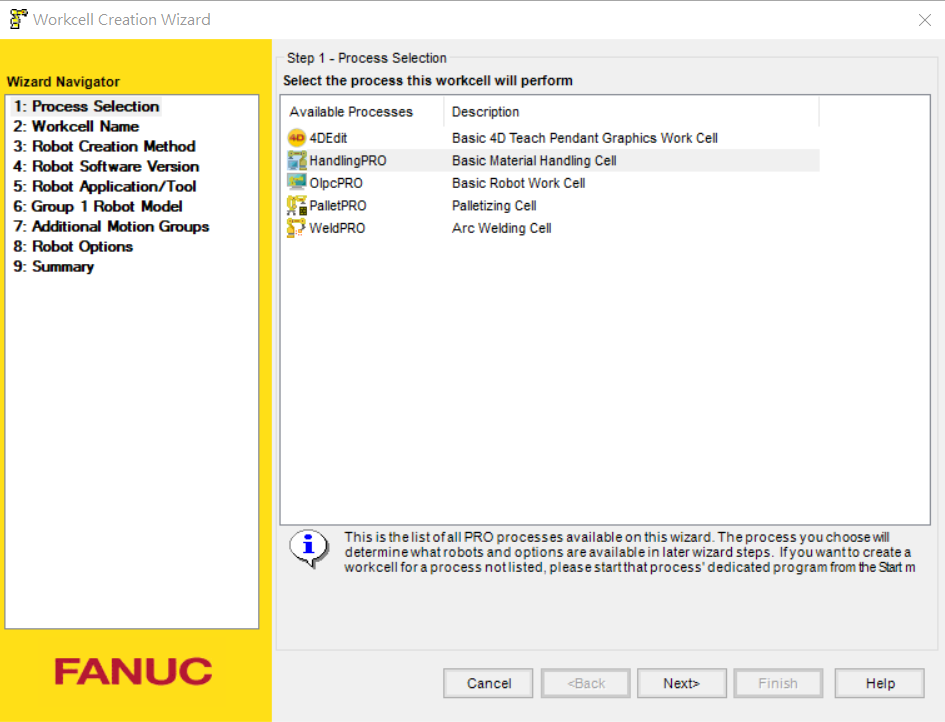

Name your workcell. Click next.

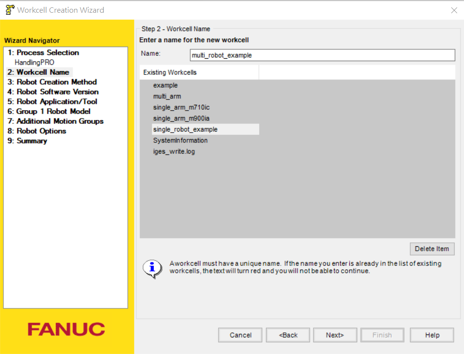

Use the default config, click next.

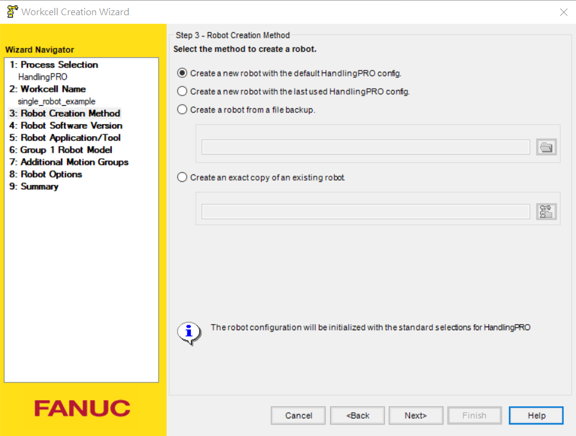

If a window pop up and ask to choose a Robot Software Version, choose the version that support your robot model. In this manual, we are using `M-900ia/350`. Since it is an older model, we use `V8.30`.

Choose `Set Eoat later` as we don't need a tool now.

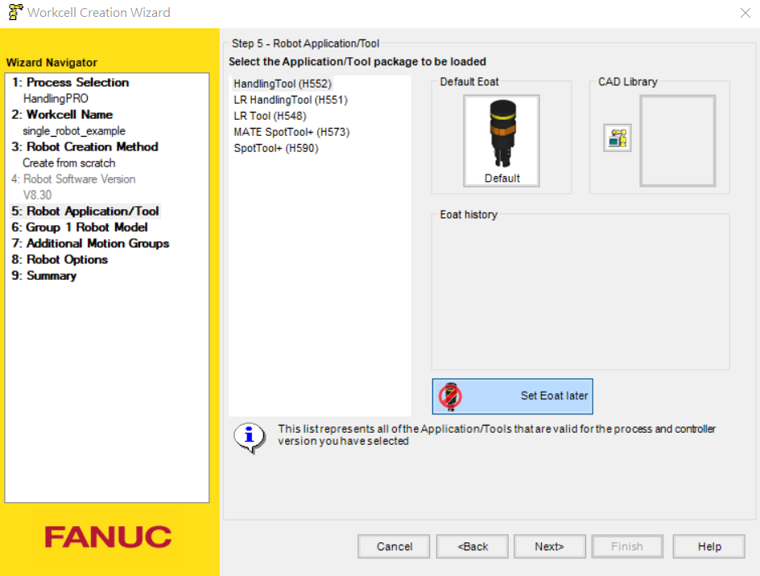

Choose your robot model, we choose `M-900ia/350` as the example.

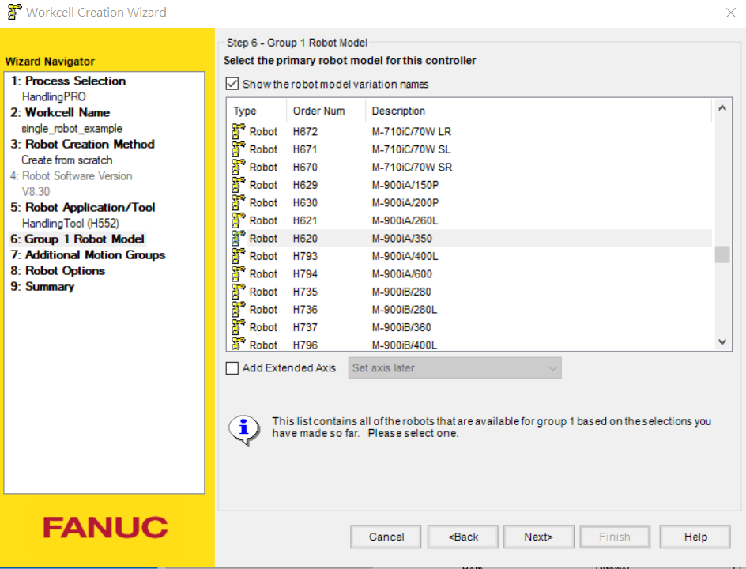

For the multi-robot case, we need additional motion groups. Choose the robot model you want on the upper tab and click `>>` botton next to `2` so that the second robot is motion group number `2`. (The first robot is motion group number `1`). 

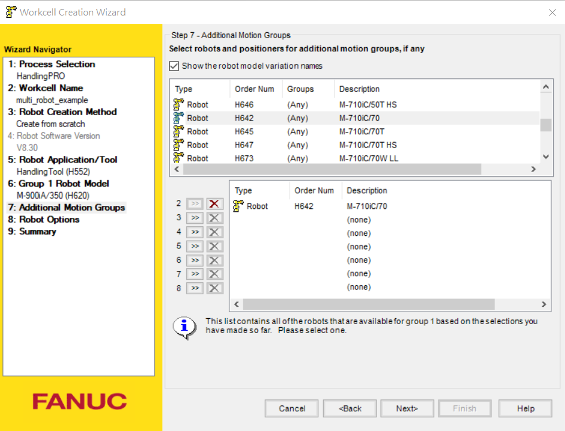

Now the robot options need to be added. Search `Karel (R632)` and `Constant Path (R663)` and click the box. Necessary for RoboGuide including `Multi-Group Motion (J601)` is added automatically by RoboGuid.

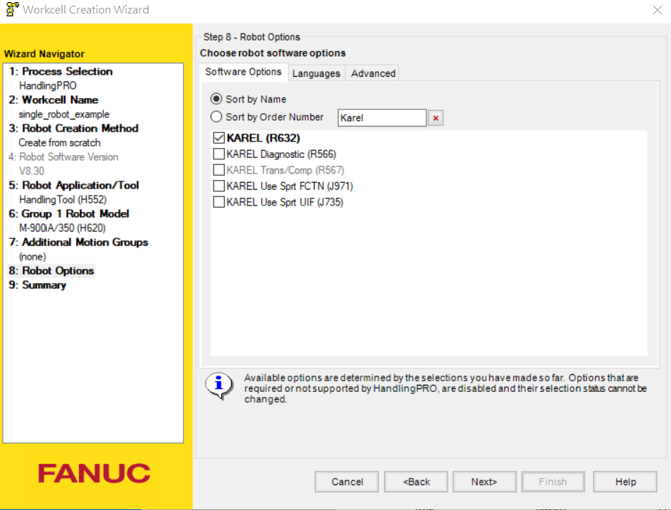
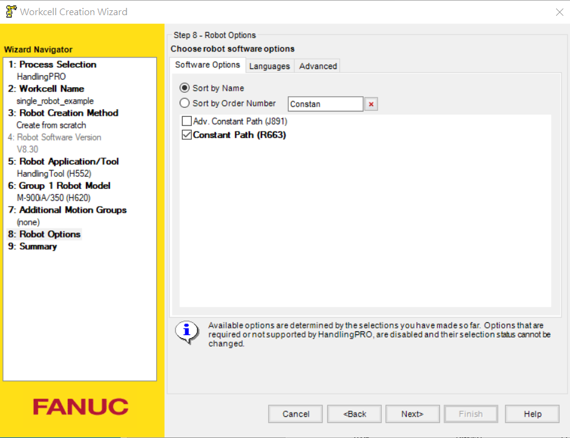

Click on `Languanges` tab and choose `English Dictionary`. Click next.

You should see an overview of your setup like this. click finish.

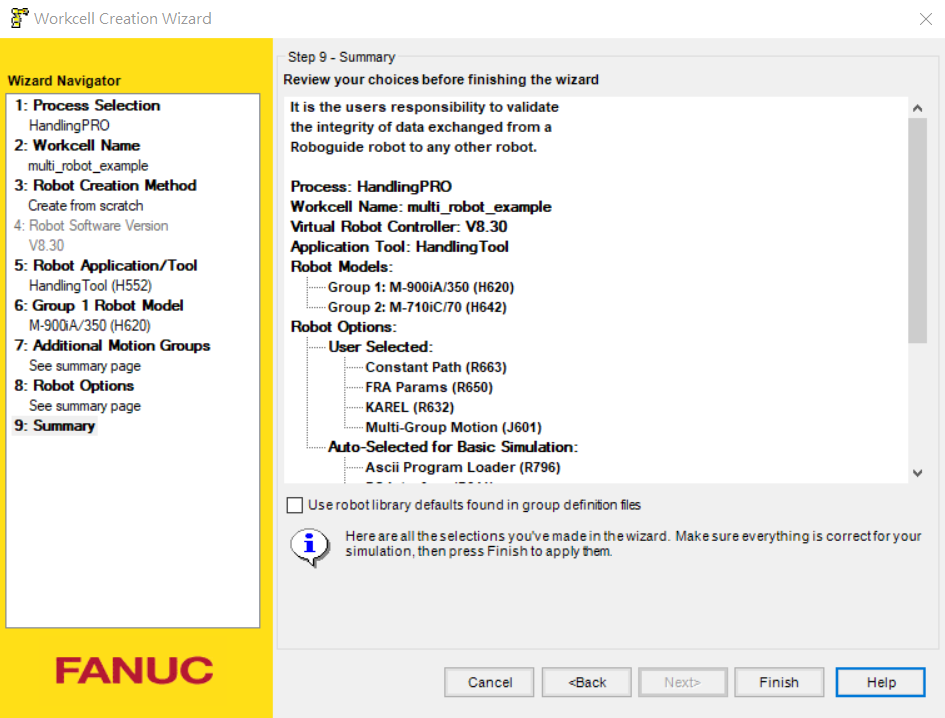

While the teach pendant panel is running robot setup, the panel will ask you to choose the flange type in the middle of setup. Choose `1` and click `ENTER` for both of the robots on your virual teach pandent. Select `1` for FSSB configuration. Enter `7` for the hardware start axis of the second robot because the first robot has 6 axis. Enter `2` for the brake number. Enter `2` for the amplifier number.

After the setup process in the virtual teach pendent is done, You should see your workcell. The robot are showed in the same starting position and you can move them to the desired transformation.

## Robot Controller Setup

We are now setting up payload, communication, user and tool frames. Click the virtual teach pandant button on the top left (under the `File` button). You should see the teach pandant pop up. Click on the blinking triangle on the top right of the teach pandant to setup payload information. Remeber that the motion will change when the payload information change. **Especially when the payload is closed to limit.**

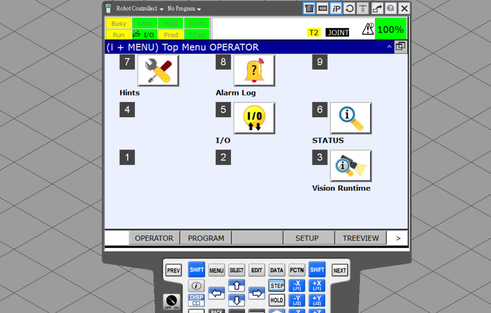

Click `SETIND` and activate PAYLOAD number `1`. Click `GROUP` and enter `2`. Click `SETIND` again and activate PAYLOAD number `1`. The blinking triangle should disappear at this point. You can change your information of payload in the future.

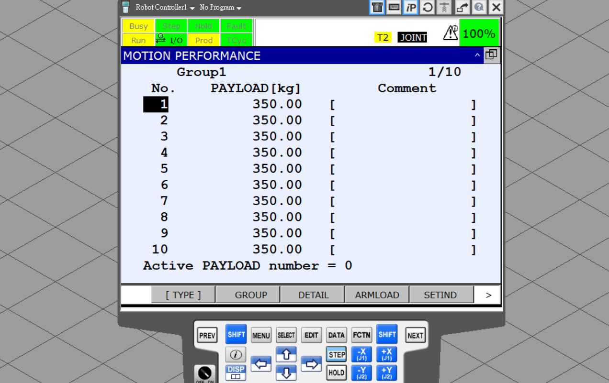

Click `MENU` button on the teach pandant, click `6 SETUP`, `0 NEXT`, `6 HOST COMMON`

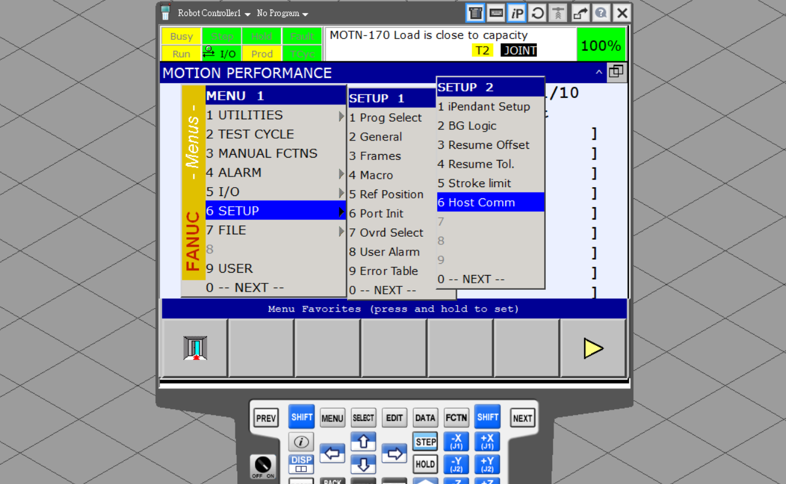

Choose `1 TCP/IP`, press `ENTER` or `DETAIL`

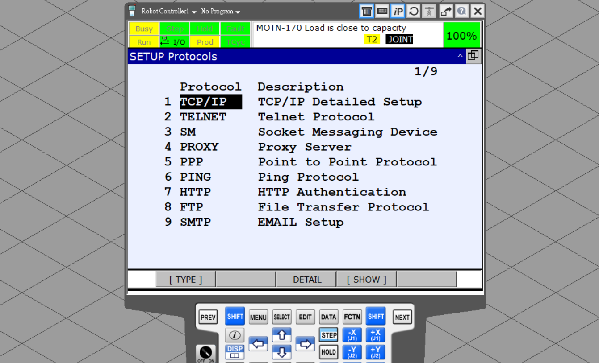

Change `Port #1 IP addr:` to the IP address you want. You can use your keyboard to enter the address (press enter and start editing). The default IP address for the python module is `127.0.0.2`. Use this address will make things easier.

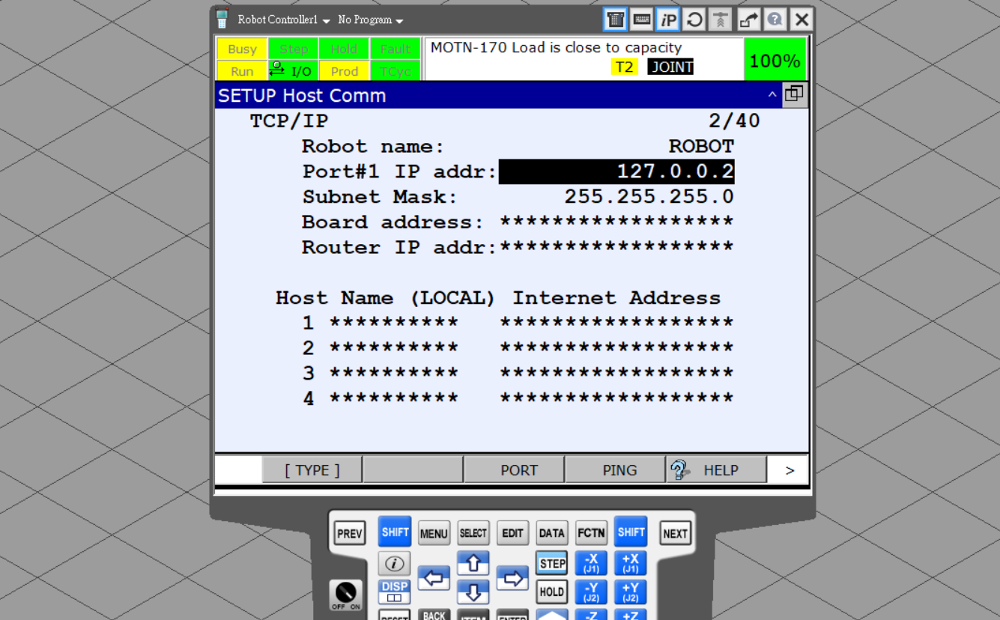

Press `PREV` on the teach pandant or `Esc` on your keyboard to go to the previous menu. Choose `7 HTTP` this time. Unlock all `iPendant`, `KAREL:*`, `KCL:*` by switch the tab to those item and click `UNLUCK`. The character should change from `A` (AUTH) to `U` (UNLOCK).

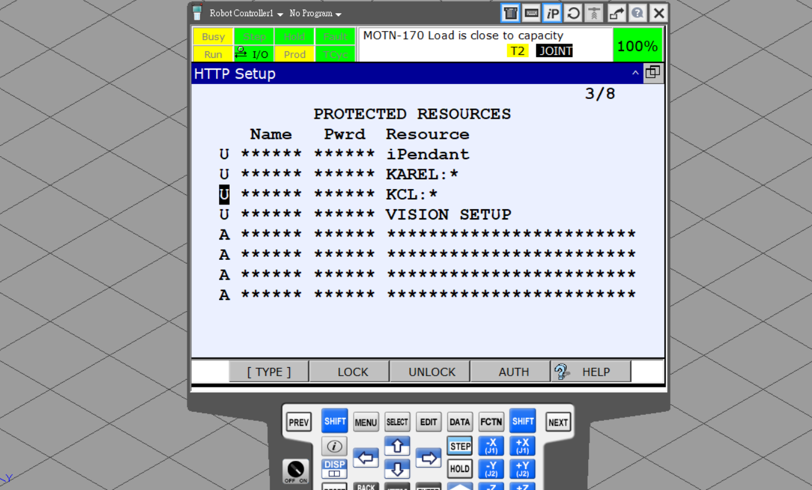

Press `MENU` button, choose `6 SETUP`, `3 Frames`. You should see `Tool Frame G1` on the top which means you are defining the frames for motion gourp `1` (i.e. the first robot). Click `[OTHER]`, `3 User Frame`. Since the default user frame (i.e. the robot base frame) is located at the intersection of the joint 1 axis and joint 2 axis, shift the frame so that the frame is on the bottom of the base of the robot. You should only needs to shift it along z-axis. The click `[OTHER]`, `1 Tool Frame` to match the tool frame of your choice. 

Click `[OTHER]` and `7 Group 2`. Redo the frame setup for motion group `2` (i.e. the second robot).

In the python module, you have the flexibility to choose which tool/user frame you are using.

## Module Program Load

Right click on the `Files`, `Add`,and add `remote_mult.kl`, `record_data_mult.kl`, `clear_reg.kl` in the `karel` folder and `MAIN_MULT.LS` in the `tp` folder.

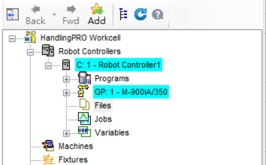

Expand the `Files` tab by clicking the plus button on the left. Right click on `MAIN_MULT.LS`, `Load`. RoboGuide will load the `LS` program to the controller. Right click on `record_data_mult.kl` and `Build`. A window will show that the translation is successful. Repeat the same process with `remote_mult.kl` and `clear_reg.kl`. RoboGuide first compile and then load the `.kl` or `Karel` program to the controller. You should also see `record_data_mult.pc` and `remote_mult.pc`. They are the compiled karel program. Expand the `Programs` tab and you should see `DATARECORDER`, `REMOTE` and `MAIN` are listed.

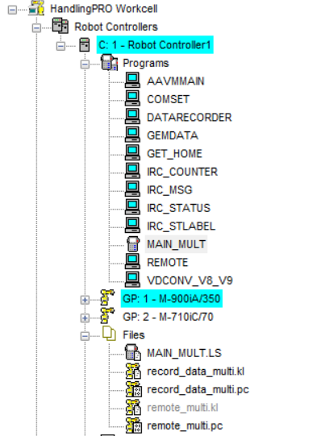

Your robot is now ready to run!