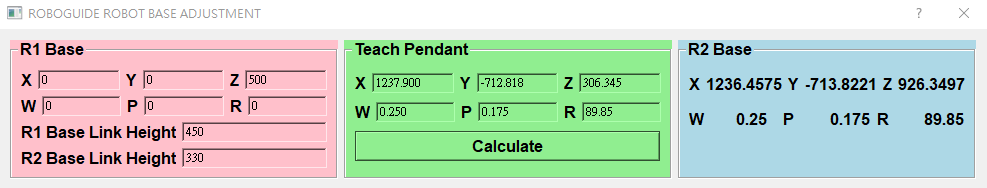
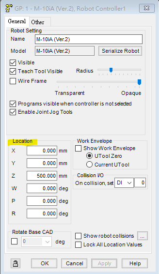
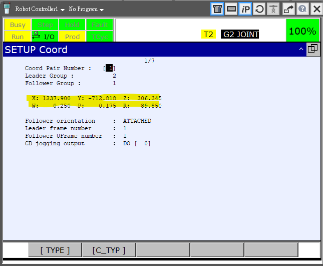
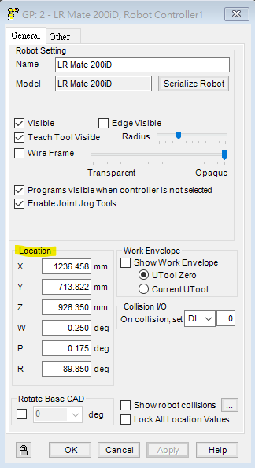

# RoboGuide Robot Base Setup

If you import a controller backup file into RoboGuide, RoboGuide does not locate robots automatically for you, which is extremely annoying.

Here, we made a easy but useful script that helps you relocate robots in the correct relative location in RoboGuide. The script will give you the correct pose of R2 given the pose of R1 and the calibration result which you can find in teach pendent.

Please execute the file
```
tools/roboguide_base_adjust.py
```

## Dependencies
- general_robotics_toolbox
- numpy
- fanuc_motion_program_exec

## Usage Guide



### R1 Base

First, check the R1 base location in the RoboGuide, and fill them in the pink boxes. You can find them in RoboGuide here (see the figure below).



### R1/R2 Base Link Height

Next, we need to provide the base link height of the both robots. The base link height is defined as **the distance from the bottom of the robot to the height of the second joint**. You can find the number in the robot manual.

### Teach Pendant Calibration Results

We finally need to fill in the calibration result in the green boxes. You can find them in the teach pendent.



### R2 Base

Click `Calculate` once you fill in all the numbers. You can see the results showed in the blue boxes. Simply fill these numbers in you RoboGuide robot2 info. You are all good to go!

