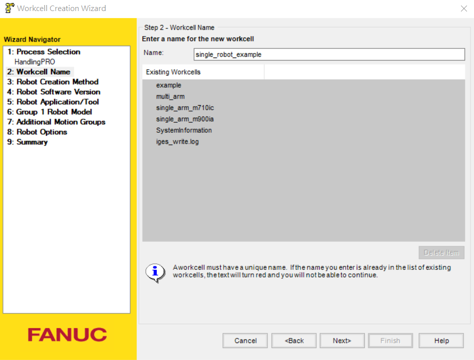
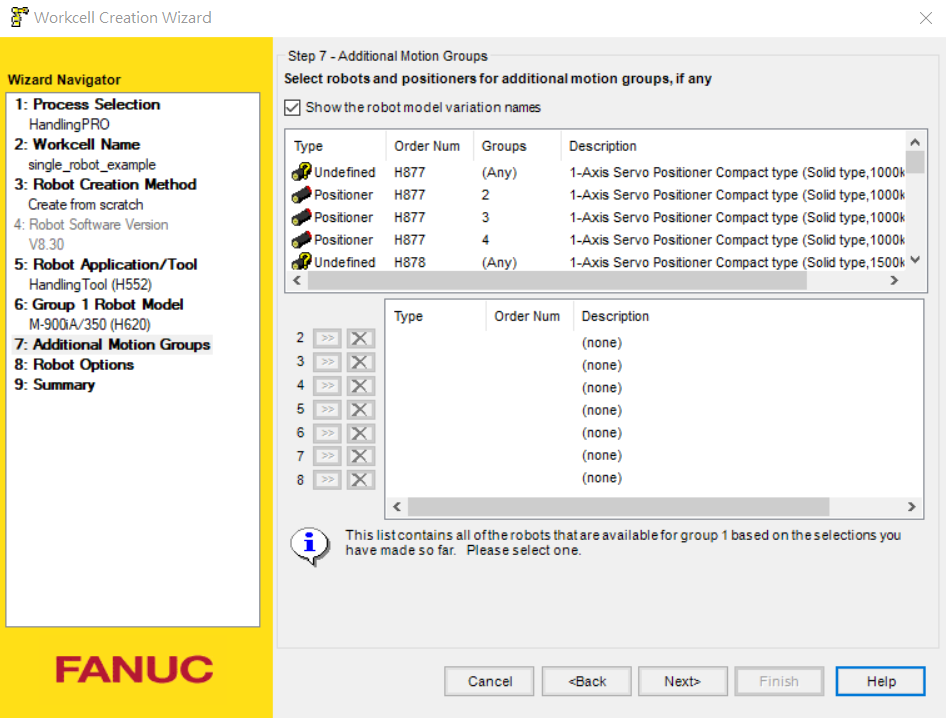
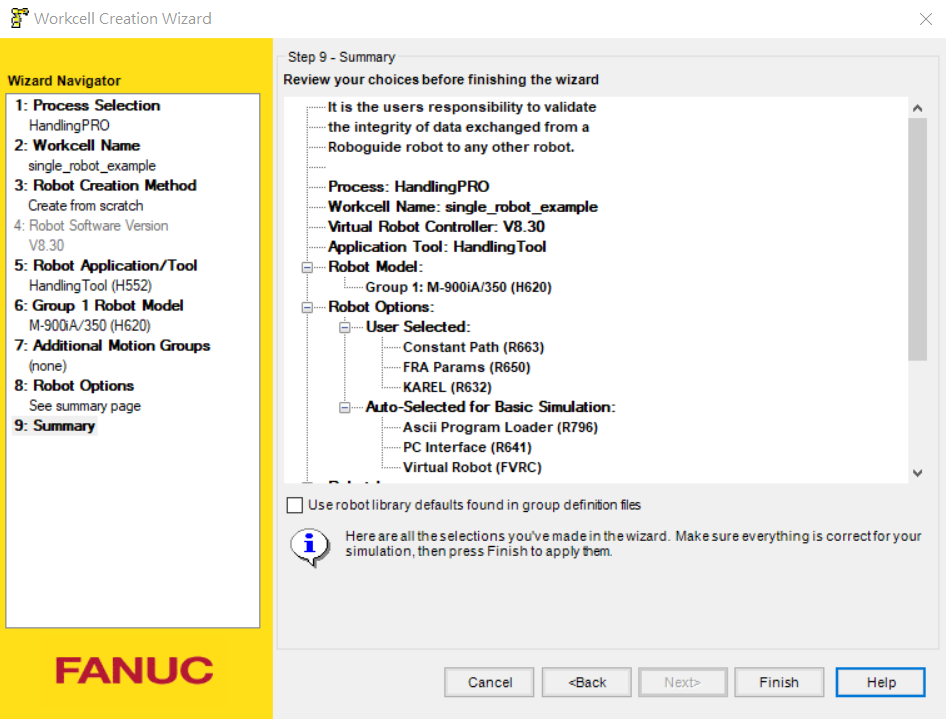
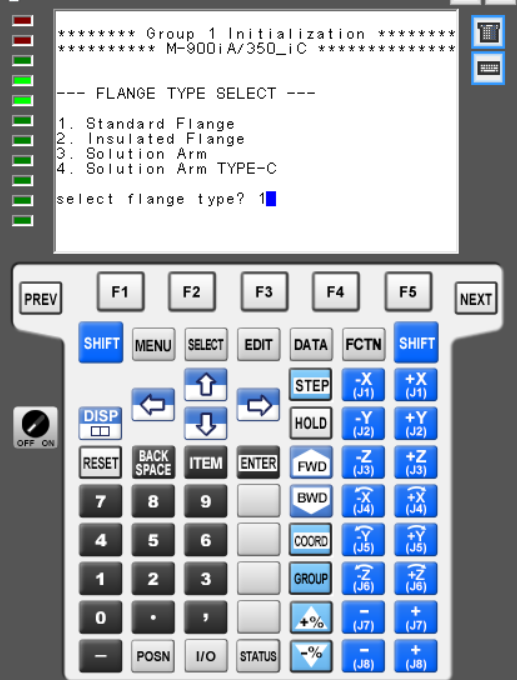

# RoboGuide Set Up

Lanuch RoboGuide and click `New Cell`, a window will pop up. Choose `HandlingPRO` and click next.

Name your workcell. Click next.

Use the default config, click next.

If a window pop up and ask to choose a Robot Software Version, choose the version that support your robot model. In this manual, we are using `M-900ia/350`. Since it is an older model, we use `V8.30`.

Choose `Set Eoat later` as we don't need a tool now.

Choose your robot model, we choose `M-900ia/350` as the example.

For the single robot case, we don't need additional motion groups. Click next without adding anything.

Now the robot options need to be added. Search `Karel (R632)` and click the box. Necessary for RoboGuide is added automatically by RoboGuid. However, we need to add an additional options for the module to work. This is believe to be a bug of RoboGuide. We recommend adding `Constant Path (R663)`

Click on `Languanges` tab and choose `English Dictionary`. Click next.

You should see an overview of your setup like this. click finish.

While the teach pendant panel is running robot setup, the panel will ask you to choose the flange type in the middle of setup. Choose `1` and click `ENTER` on your virual teach pandent.

